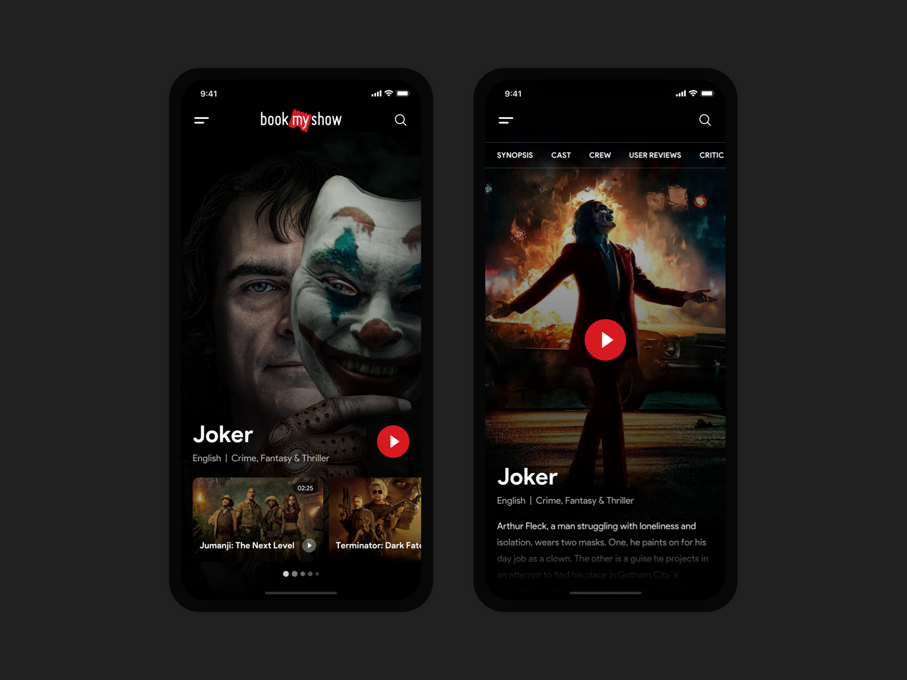
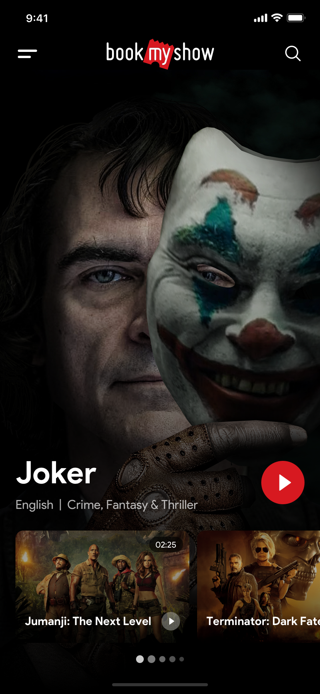
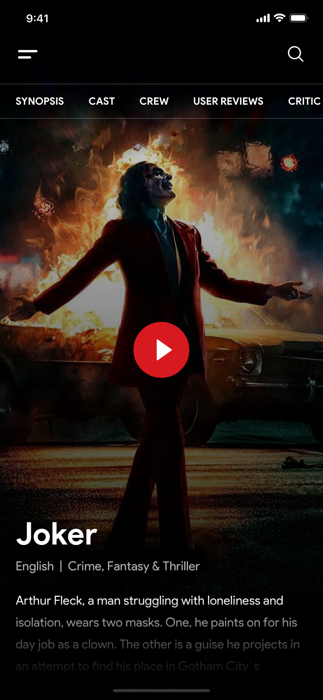

# Movies Explore

App concept created with android using flutter programming language, inspired by [Movie Explorer.](https://www.uplabs.com/posts/movie-explorer-service-app-for-watching-movies-and-tv-series) design found on uplabs.

The same design can also be found on [Movie Explorer Service App for Watching Movies and TV Series.](https://dribbble.com/shots/7734747-Movie-Explorer-Service-App-for-Watching-Movies-and-TV-Series) design found on dribble.

## About
The app was created to simulate all the system behind the UI kit in the link. There's no code on backend or other web service. The app is all contained in this repository. The models classes was created to better representate an official development, the repositories classes simulate a web request.

## The Inspiration
The images below shows the inspiration concept of the app.

App  Preview
:-------------------------:

The images below shows the home and detail screens of the app.

Home Screen      |  Detail Screen
:-------------------------:|:-------------------------:
  |  

## Design Details
As exposed on the inspiration video, there's all the design details also present in this app.

## Notes
Finished